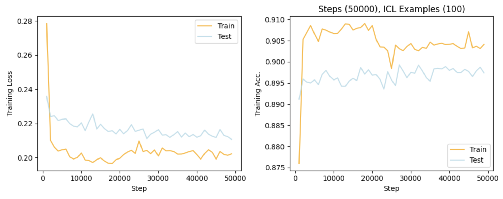
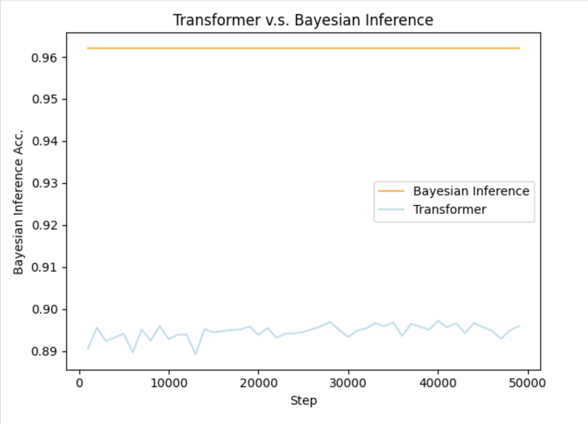
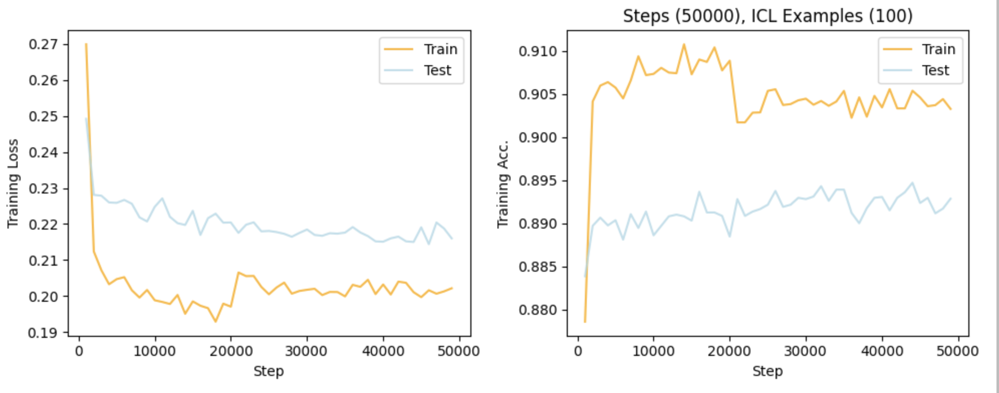
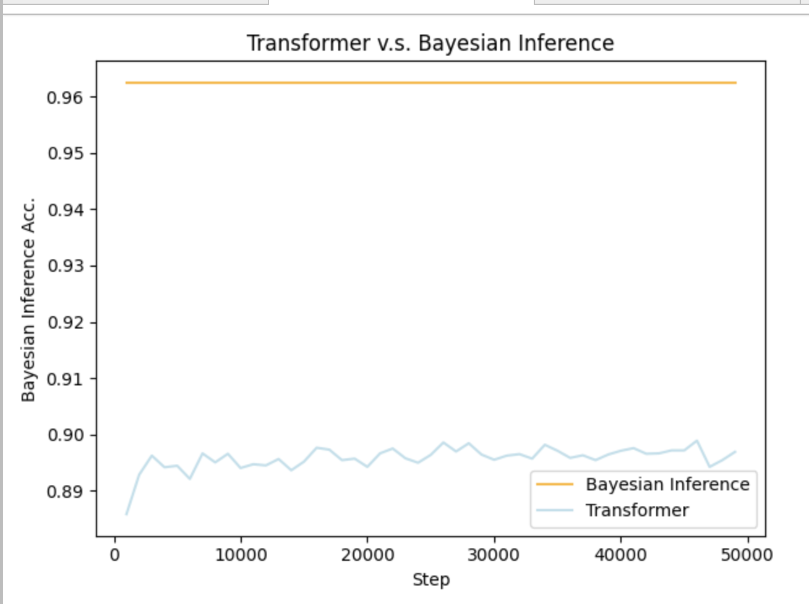

# Transformer-Bayesian-Inference


### Installation
```
python -m venv ./env
source ./env/bin/activate
pip install -r requirements.txt
```

### Data  Sampling

```python
from utils import *

network = get_wet_grass_network() 
# This will generate a Bayesian Network (4 variables) with randomly initialized probability table

x = network.sample(10) 
# This will sample from the network 10 times, resulting a (10, 4) matrix.

```

### In-Context Data Generation

```python

from data import DataGenerator

D = DataGenerator("wet_grass")

D.generate_in_context_examples(10) 
# This will initialize a wet_grass network, and generate 1 in-context sample with 10 examples.
# All these 10 examples are sampled from the same network, and encoded in the way that paper describes

```

### Model

```python
from models import *

# If we follow the above example, we have to set the parameters as following
n_dims = 8
n_positions = 11

model = TransformerModel(n_dims, n_positions, n_embd=128, n_layer=12, n_head=4)

```

### Run Experiment

```
python3 main_fast.py --num-examples 200 --steps 10000 --layers 12
python3 evaluate_fast.py --num-examples 200 --steps 10000 --layers 12
```

### Results

```yaml
layer : 6
num-example: 100
hidden-dim: 128
steps: 50000
curriculum: True
init_lr: 1e-4
```




```yaml
layer : 12
num-example: 100
hidden-dim: 128
steps: 50000
curriculum: True
init_lr: 1e-4
```





note: `autopep8 --in-place --aggressive --aggressive <filename>`